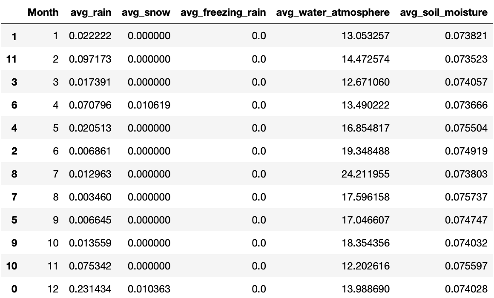
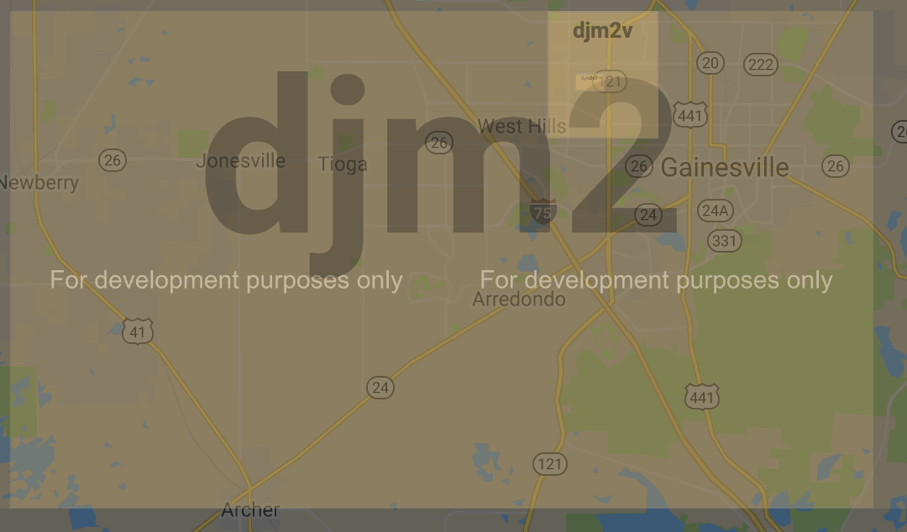
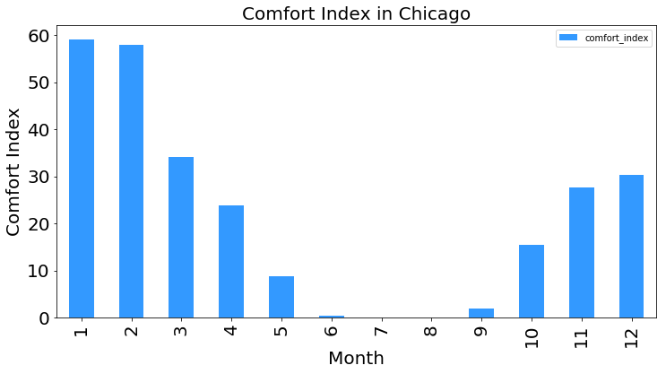

# Project 3: Spatiotemporal Analysis with Spark (v 1.0)

Project Specification: https://www.cs.usfca.edu/~mmalensek/cs677/assignments/project-3.html

Check your Jupyter notebook(s), code, materials, etc. into this repo.

### mcdomingo TODO:

| Part | Person | Filters | Analysis | Editing
| ---- |:------:|:-------:|:--------:| ------:|
| [Warmups](mcdomingo_warmup) | mcdomingo | done | done | done |
| [Escaping the Fog](The_Answers_Wow/escaping_the_fog.ipynb) | mcdomingo | done | done | done |
| [Climate Chart](The_Answers_Wow/climate_chart.ipynb) | mcdomingo | done | done *Need to EC* | done |
| [Influencers](The_Answers_Wow/influencers.ipynb) | mcdomingo | done | done | done |
| Option 1: Heatmap of crimes (hypothesis) | mcdomingo | N/A | done | done | 
| [Option 1: Heatmap of crimes](The_Answers_Wow/crime_over_time.ipynb) | mcdomingo | done | done| done | 

### ohbriansung TODO:

| Part | Person | Filters | Analysis | Editing
| ---- |:------:|:-------:|:--------:| ------:|
| Drying out | ohbriansung | done | done | done |
| Travel Starup | ohbriansung | done | done | done |
| Option 1: Describe the dataset | ohbriansung | done | N/A | done |
| Option 1: Outline the insights | ohbriansung | done | N/A | done |
| Option 1: Make hypotheses | ohbriansung | done | N/A | done |
| Option 1: Crime Types by date | ohbriansung | done | done | todo |

## Warm-up

### Unknown feature

### Hot hot hot

For the entire data set \(hdfs://orion11:13030/nam/*\), the hotest day was August 22, 2015 (UTC) with a 58.24 Degrees Celsius (331.4 Degrees Kelvin). It was an anomaly since the temperature was way off the normal range and it's a outlier displayed in the box graph below.

### So snowy

## Analysis

### Drying out

#### Here is the camp fire in California, North America in November, 2018 that costed over 80 lifes.

* Let's find out which was the driest month in this location. Camp fire actural location: [\(source\)](https://www.npr.org/2018/11/25/670652466/northern-california-camp-fire-contained)

\(I just wish I could view image on Twitter!\)

* Camp fire location geohashes: (9r16, 9r13, 9r19, 9r1d)

* For the rain/snow frequency, August is the lowest month.
* For evaporation cease soil moisture, August is the highest one. Moreover, the more water evaporation from soil means the drier the air is.
* August is the driest month for that region.
* Although rain frequency indicates that November is more rainy. However the data only show if it rain or not instead of the amount of rain. So, as we can tell from evaporation cease soil moisture, November is the second driest month. That might be the reason it's very easy to spread fire during November.

### Travel startup

#### 1.  **San Francisco**: "9q8y"

* The smaller the comfort index is, the more comfortable it is.
* From our result, the best month to visit San Francisco is October.
* U.S. News indicates that the best time to visit San Francisco is between September and November. [source](https://travel.usnews.com/San_Francisco_CA/When_To_Visit/)

#### 2.  **Gainesville, FL**: "djm2"

* The best month to visit Gainesville, FL is April or May.
* These two websites indicates that the time around April is the best time to visit. [source1](https://www.eliotandme.com/when-to-visit/Gainesville,+FL,+USA) [source2](https://championtraveler.com/dates/best-time-to-visit-gainesville-fl-us/)

#### 3.  **Seattle**: "c22z", "c22y", "c23p", "c23n"

* June, July, and August are the best month to visit Seattle.
* U.S. News indicates that Summer is the best season to visit Seattle. [source](https://travel.usnews.com/Seattle_WA/When_To_Visit/)

#### 4.  **Austin, TX**: "9v6k", "9v67", "9v6s", "9v6e"

* April, May, and October are the best months to visit Austiin, TX.
* U.S. News indicates that the best times to visit Austin are September to November or March to May. [source](https://travel.usnews.com/Austin_TX/When_To_Visit/)

#### 5.  **Chicago**: "dp3w", "dp3t"

* July and August are the best months to visit Chicago.
* This [article](https://santorinidave.com/best-time-to-visit-chicago) indicates that the best times to visit Chicago is in late Spring, early summer, and early fall.

## Option 1

* Data source: [data.gov](https://catalog.data.gov/dataset/crimes-2001-to-present-398a4)

* Describe the dataset:

    This dataset reflects reported incidents of crime that occurred in the City of Chicago from 2001 to August 9, 2018, minus the most recent seven days.

    Columns in the dataset: ['ID', 'Case Number', 'Date', 'Block', 'IUCR', 'Primary Type', 'Description', 'Location Description', 'Arrest', 'Domestic', 'Beat', 'District', 'Ward', 'Community Area', 'FBI Code', 'X Coordinate', 'Y Coordinate', 'Year', 'Updated On', 'Latitude', 'Longitude', 'Location']

* Outline the types of insights you hope to gain from it:

    1. Most common type of crime each year and each date in Chicago.
    1. The changes of crime over time in Chicago.
    1. 

* Make hypotheses about what you might find:

    1. According to [this website](https://www.criminaljusticedegreehub.com/what-are-the-most-common-crimes-in-the-united-states/), theft should be the most common type of crimes.
    1. A lot of crimes that were categorized as [Battery](https://en.wikipedia.org/wiki/Battery_(crime) type occurred during Black Friday.
    1. Most of the crimes happened in [these neighborhoods](https://www.roadsnacks.net/these-are-the-10-worst-chicago-neighborhoods/).
